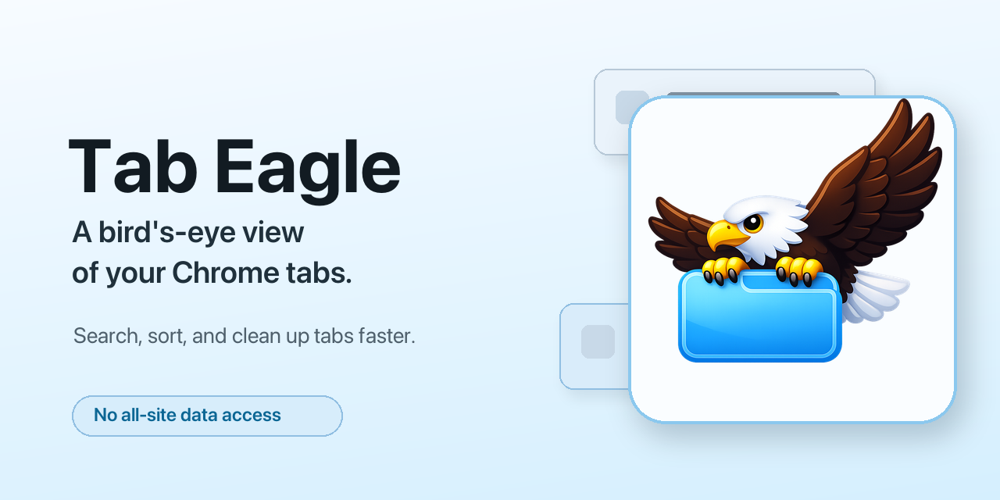
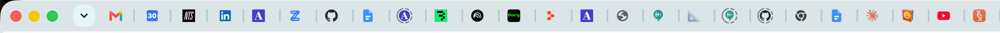
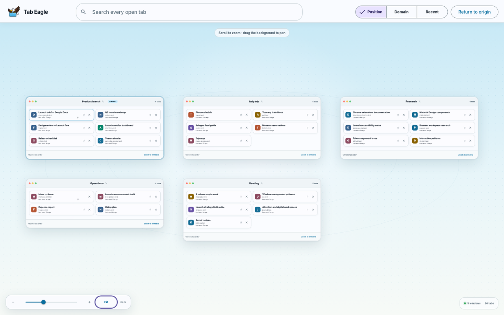
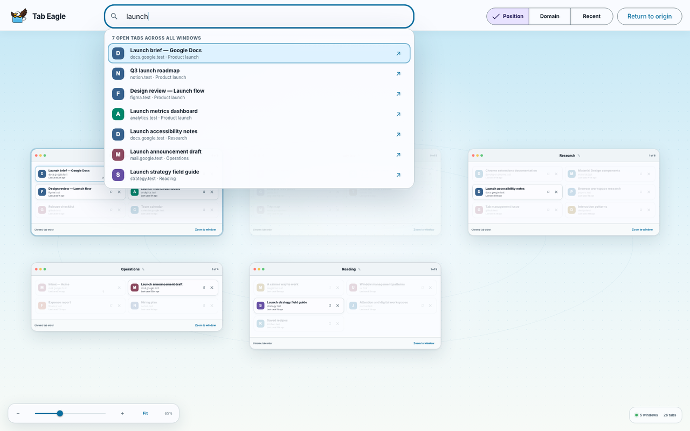
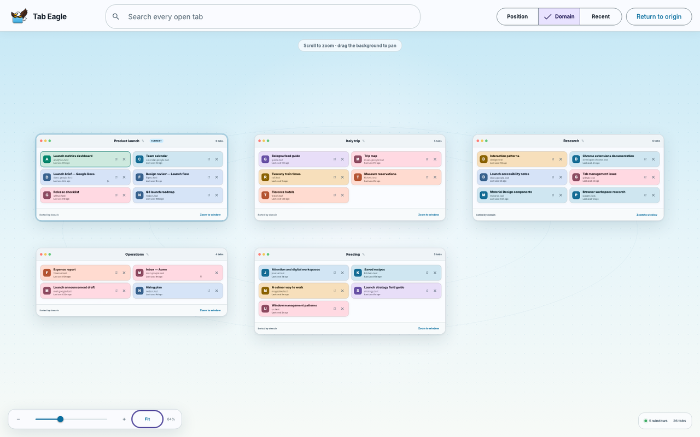
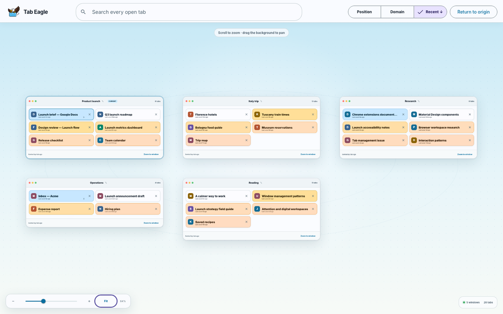

<div align="center">



# Tab Eagle

**A bird's-eye view of your Chrome tabs. Search, sort, and clean up faster.**

[](#install)
[](public/manifest.json)


[Install](#install) · [Features](#features) · [Screenshots](#screenshots) · [Privacy](#privacy) · [Development](#development)

</div>

## Demo

<!-- TODO: replace with docs/demo.gif. A 5-10s loop: open Tab Eagle, type to search, toggle Domain/Recent, close a card -->

> **▶ Demo GIF placeholder.** Drop a short screen recording at `docs/demo.gif` and swap this block for:
> ``

## What it does



Too many tabs, and Chrome's tab strip turns into an unreadable row of favicons. Tab Eagle opens a full-page grid of every tab in the current window, so you can see everything at once and jump to the one you want by typing its name instead of squinting at the bar.

## Features

- **Type to search** across every open tab by title and domain
- **Sort** by position, domain, or recent activity; click Recent again to flip newest and oldest
- **Read later** sends any tab to Chrome's Reading List in one click
- **Close tabs** straight from the grid, without switching to them first
- **Click a card** to jump to that tab
- **No creepy permissions**, so it can't read the content of your pages

## Install

**From the Chrome Web Store:** _coming soon._ The listing link will go here.

<details>
<summary>Load the development build manually</summary>

```sh
npm install
npm run build
```

Then in Chrome:

1. Open `chrome://extensions`.
2. Enable **Developer mode**.
3. Click **Load unpacked**.
4. Select the `dist` folder from this repo.

On macOS, `Command+Shift+E` opens Tab Eagle. If Chrome leaves the shortcut unassigned because of a local conflict, set it manually at `chrome://extensions/shortcuts`.

</details>

## Screenshots

| Overview | Type to search |
| --- | --- |
|  |  |
| **Sort by domain** | **Sort by recent** |
|  |  |

## Privacy

Tab Eagle is built so it *can't* spy on you. I didn't want it to have access to all your data on all websites, so it doesn't ask for any of the creepy permissions that would allow that. It requests only:

- `tabs`
- `storage`
- `readingList`
- `favicon`

None of these let it read or modify the content of the pages you visit. See [PRIVACY.md](PRIVACY.md) for details.

## Development

```sh
npm run typecheck
npm test
npm run build
```

GitHub Actions builds, tests, and packages the extension on pull requests and pushes to `main`.

Contributions are welcome. Check the [issues](https://github.com/pcomans/tab-eagle/issues) for anything tagged `good first issue`.

### Releases

To publish a GitHub Release with a ZIP attached, make sure `package.json` and `public/manifest.json` have the same version, then push a matching version tag:

```sh
git tag v0.1.0
git push origin v0.1.0
```

The release workflow attaches `tab-eagle-<version>.zip`, which you can upload to the Chrome Web Store.

---

<div align="center">

If Tab Eagle dug you out of tab overload, a star helps other people find it.

</div>
